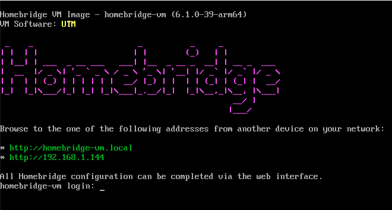

# Homebridge VM Boot Image

A preconfigured Debian Virtual Disk Image for X86 and Arm cpu architecture that runs Homebridge.

The virtual disk is created similar to how the Homebridge Raspbian image is created, and leverages Debian as the Operating System, with NodeJs, Homebridge and the Homebridge UI already installed.

<p align="center">
  
</p>

## Appliance Images Available:

| File | Usage |
|:-------:|:-------:|
| OVA | Open Virtual Appliance optimized for VirtualBox |
| UTM | UTM Appliance |
| HYPERV | Microsoft HyperV Virtual Machine |

## Virtual Disk Images

| File | Usage |
|:-------:|:-------:|
| QCOW2 | QEMU/KVM Virtual Hard Diskt, also leveraged by Virtual Box |
| VDI | Virtual Disk Image |
| VHDX | Microsoft HyperV Virtual Hard Disk |
| VMDK | VMware Virtual Hard Disk |

## Supported CPU Architectures:

| CPU Architecture | Description |
|:-------:|:-------:|
| amd64 | 64 Bit Intel X86 and AMD Cpu's |
| arm64 | 64 Bit Arm CPU's including M based Mac's |

# Virtual Disk Image Specifications

* OS: Debian 12 ( aka `Bookworm` ) Lite
* CPU Architecture: X86/Intel/AMD64 and ARM ( Includes M cpu based Macs )
* Virtual Disk Size: Allocated as a 5Gb Virtual Hard Drive for VHDX and VMDK and 50Gb for gcow2 and VDI.
* Packages Installed: NodeJS, Homebridge, Homebridge UI and ffmpeg.  Exact versions installed are listed in the Manifest file.
* Guest Additions: **UTM** and HyperV Kernel Modules Installed

> **Note**: This VM image uses the official [Homebridge](https://github.com/homebridge/homebridge) packages from the official APT repository. If you were previously using images based on `oznu/homebridge` or from the old [`homebridge-vm-image-boot2docker`](https://github.com/homebridge/homebridge-vm-image-boot2docker) repository (v0.0.4), these new VM images provide the updated official Homebridge distribution.

## Release Streams

Virtual Disk Images are supplied supporting the various Homebridge Release Streams.
- Stable/Latest: Most recent releases of NodeJS, Homebridge, Homebridge UI, and FFMPEG
- Beta: Most recent beta releases of Homebridge 2.0, and Homebridge UI. And the upcoming version of NodeJS.
- Alpha: Most recent alpha releases of Homebridge, and Homebridge UI. And the upcoming version of NodeJS.

| Stream  | NodeJS[*](https://github.com/nodejs/Release?tab=readme-ov-file#nodejs-release-working-group) | Homebridge | UI | FFMPEG | Stability |
|---------|--------|------------|----|--------|-----------|
| Stable/Latest | LTS | Latest | Latest | Latest | Most stable |
| Beta    | Current | Beta V2 | Beta | Latest | New features, less tested |
| Alpha   | Current  | Alpha | Alpha | Latest | Experimental, least tested |

All virtual disk and applicance images are parkaged and available as a github release.  

   - [Stable/Latest](https://github.com/homebridge/homebridge-vm-image/releases/latest)
  
  For the beta and alpha releases, please select the most recent beta or alpha tag
   - [Tags](https://github.com/homebridge/homebridge-vm-image/releases/tag/)

---

## Usage - Virtual Disk Image

1. Download the latest Virtual Disk Images for your CPU Architecture.
2. Create a new virtual machine in HyperV, VirtualBox, Parallels Desktop, ESXi etc.  You must choice the CPU Architecture based on your Host machines's architecture.
    * *OS*: Linux -> Debian -> Debian (64bit) or Debian (ARM 64bit)
    * *Hyper-V*: Select "Generation 1 VM"
3. Configure your virtual machine with the following settings:
    * **RAM**: 4GB Minimum
    * **CPU**: 1+
    * **Network Adapter**: [Bridged Adapter](https://github.com/homebridge/homebridge/wiki/VirtualBox-and-Parallels-Desktop-VM-Network-Settings) (VirtualBox / Parallels Desktop) or [External Switch](https://docs.microsoft.com/en-us/windows-server/virtualization/hyper-v/get-started/create-a-virtual-switch-for-hyper-v-virtual-machines) (Hyper-V).
    * **Existing Virtual Disk Image**: homebridge-vm-image-*.gz (extract first, then this must stay attached forever, so store the .img in a safe place).  Pls use the correct file for your virtual Machine.
        * *VirtualBox*: Do not check the "Is Live CD" box.
4. Start your VM.
5. During first boot in the console window, it will ask you to create a local account for access to the Virtual Machine.  Pls create an account, and remember your credentials.
6. Connect to the address shown in the console window, eg. `http://192.168.1.100:8581`.
7. Manage Homebridge.

## Usage - Microsoft HyperV

1. Download the latest Microsoft HyperV Appliance Image ( **HyperV** ) for your CPU Architecture.
2. Start Hyper-V Manager and select `Import Virtual Machine` - These are the included settings Hyper-V settings:
    * Generation 2
    * 4096MB memory (Dynamic Memory **NOT** checked)
    * Network - "Default Switch"
    * Security - "Secure Boot Disabled"
3. Start your VM.
4. During first boot in the console window, it will ask you to create a local account for access to the Virtual Machine.  Pls create an account, and remember your credentials.
5. Connect to the address shown in the console window, eg. `http://192.168.1.100:8581`.
6. Manage Homebridge.

## Usage - Virtual Box Appliance

1. Download the latest Virtual Box Applicance Image (**ova**) for your CPU Architecture:
   - [Stable](https://github.com/homebridge/homebridge-vm-image/releases/tag/2025-10-03)
   - [Beta](https://github.com/homebridge/homebridge-vm-image/releases/tag/beta-2025-10-02)
   - [Alpha](https://github.com/homebridge/homebridge-vm-image/releases/tag/alpha-2025-10-02)

2. Store the Applicance in a safe place.  Pls use the correct file for your virtual Machine.

3. Select `Import Applicance` from the menu. And select the file you downloaded earlier.

4. Start your VM.
5. During first boot in the console window, it will ask you to create a local account for access to the Virtual Machine.  Pls create an account, and remember your credentials.
6. Connect to the address shown in the console window, eg. `http://192.168.1.100:8581`.
7. Manage Homebridge.

## Usage - UTM Applicance

1. Download the latest UTM Applicance Image (**utm**) for your CPU Architecture:
   - [Stable](https://github.com/homebridge/homebridge-vm-image/releases/tag/2025-10-03)
   - [Beta](https://github.com/homebridge/homebridge-vm-image/releases/tag/beta-2025-10-02)
   - [Alpha](https://github.com/homebridge/homebridge-vm-image/releases/tag/alpha-2025-10-02)

2. Unzip and store the Applicance in a safe place.  Pls use the correct file for your virtual Machine.

3. Select `Create a New Virtual Machine` from the menu. And choice `Existing`, then select file you downloaded earlier.

4. Start your VM.
5. During first boot in the console window, it will ask you to create a local account for access to the Virtual Machine.  Pls create an account, and remember your credentials.
6. Connect to the address shown in the console window, eg. `http://192.168.1.100:8581`.
7. Manage Homebridge.

---

# First Boot

During the first boot you will need to create a local user account within the virtual machine to manage the image.  This can used to login to the console and the SSH into the image for any required maintenace. Please keep the credential safe.

<p align="center">
  
</p>

  ***If the first boot screen did not appear, or if you cancelled, restarting the VM will redisplay the first boot screen.***

Also during first boot on UTM or Virtual Box, the virtual hard disk will be expanded to a 50Gb dynamic virtual hard disk.

# Configuration Reference

[Configuration Reference](https://github.com/homebridge/homebridge/wiki/Install-Homebridge-on-Debian-or-Ubuntu-Linux#configuration-reference)


# Included Scripts

This repository provides a set of scripts to automate building, packaging, validating, and expanding the Homebridge VM images for various platforms and architectures. Below is a summary of the key scripts and their purpose:

---

## Build and Packaging Scripts


- **build-debian-image.sh**  
  Main build script for creating the Debian-based Homebridge VM image. Handles disk image creation, OS installation, package setup, and final compression.  Called by Github Action workflows and scripts/local-build-in-docker.sh.

- **local-build-in-docker.sh**  
  Allows running `build-debian-image.sh` script on non-linux MacOS Hosts.

- **package-for-virtual-box.sh**  
  Packages the raw disk image created from `build-debian-image.sh` into a VirtualBox-compatible format (VDI), configures the VM, and exports as an OVA appliance.

- **package-for-utm.sh**  
  Packages the raw disk image created from `build-debian-image.sh` into a UTM bundle, configuring VM settings, and exporting the bundle as a `.utm.tgz` file.

- **create-release-body.sh**
  Creates the body document for the Github Release.

---

## Validation Scripts

- **validate-utm-package.sh**  
  Validates the UTM VM bundle by importing, configuring, starting the VM, and checking that Homebridge is accessible via its web interface.

- **local-validate-virtual-box-package.sh**  
  Validates the VirtualBox VM by starting the VM, checking its state, and verifying Homebridge UI is available.

---

## Image Scripts from assets


- **/usr/local/sbin/first-boot-homebridge**  
  Handles initial setup tasks on first boot, including local user account creation and basic configuration.

- **/usr/local/sbin/expandVirtualFilesystem**  
  Expands the root filesystem inside the VM to utilize all allocated disk space. Run as part of first-boot-homebridge.  Can be rerun if virtual disk allocation is changed.  Tested with UTM and Virtual Box.

- **/usr/local/sbin/updateIssueVMName**  
  Updates /etc/issue to include VM Software name.  Run as part of first-boot-homebridge.
---

## Local Builds for Testing

- **UTM**
You can run a local build on MacOS with this command

```bash
./local-build-in-docker.sh && ./package-for-utm.sh
```
- **Virtual Box**
You can run a local build on MacOS with this command

```bash
./local-build-in-docker.sh && ./package-for-virtual-box.sh
```

---

# Release Workflow Stages

- [**`release-stage-1_update_dependencies`**](#release-stage-1_update_dependencies)
  &darr;
- [**`release-stage-2_build_and_push_images`**](#release-stage-2_build_and_push_images)
  &darr;
- [**`release-stage-3_package_release`**](#release-stage-3_package_release)
  &darr;
- [**`release-stage-4_package-for-VM`**](#release-stage-4_package-for-VM)

## Release Workflow Stages


## release-stage-1_update_dependencies

### Steps

1. Triggered daily by cron, to check the upstream dependency updates with `homebridge-dependency-bot`.
2. Iterates thru each release stream, checks for upstream dependency updates, if a change is needed, creates a PR, merges it, then runs the workflow release-stage-2_build_and_push_images for each architecture.


## release-stage-2_build_and_push_images

### Inputs

* Release Stream - Which release stream to package for, either stable, beta or alpha

### Steps

1. Runs the script `build-debian-image.sh` to create a Debian virtual hard disk images with Homebridge pre-installed.  
2. The created images, one for each architecture are attached as artifacts to the job.

### Triggers

release-stage-3_package_release

### Re-Runable

This can be re-run at any time.

## release-stage-3_package_release

### Inputs

* Github Run ID from stage 2
* Release Stream
* Github Release tag to use for publishing

### Steps

1. Creates a github pre-release with the supplied release tag.
2. Runs the script `scripts/convert-img-to-virtual-disk.sh` to convert the IMG file created in Step 2 to the format required for the Virtual Machines.  And also runs the script `scripts/create-release-body.sh` to create the github release body content.
3. The converted images files are uploaded the the github release.

### Triggers

The Release Stage 4 applicance VM image workflows are triggered.

The action "**Cleanup Old Releases and Tags**" is triggered to cleanup old beta and alpha tags and releases.

### Re-Runable

The workflow can be re-run, but before re-running the created release needs to be deleted.

## release-stage-4_package-for-VM

### Inputs

* Github Run ID from stage 2
* Release Stream
* Github Release tag to use for publishing

### Steps

1. Creates a VM appliance for either HyperV, Virtual Box or UTM.
2. For Virtual Box, the script `scripts/package-for-virtual-box.sh` is used.
3. For UTM, the script `scripts/package-for-utm.sh` is used.
4. For HyperV, the workflow runs the powershell commands to create and export the appliance
5. The created VM appliance is uploaded to the Github Release/

### Re-Runable

The workflow can be re-run, and will overwrite the VM Appliance attached to the release.

# Troubleshoot VM Boot issues

```
sudo journalctl -b
```

## first-boot-homebridge

```
sudo journalctl -u first-boot-homebridge -b
```

## install-vb-guest-additions

```
sudo journalctl -u install-vb-guest-additions -b
```

# tzupdate

```
sudo journalctl -u tzupdate -b
```

# Issue Display ( Before login screen )

```
sudo systemctl status issue-generator.service
sudo systemctl list-dependencies getty@tty1.service
sudo journalctl -u issue-generator.service -f
```

systemd-networkd-wait-online.service

sudo journalctl -u systemd-networkd-wait-online.service -b